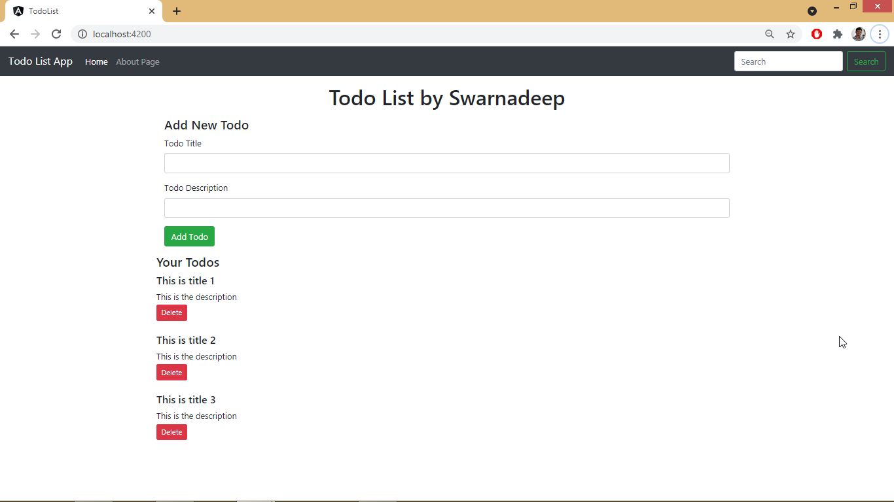
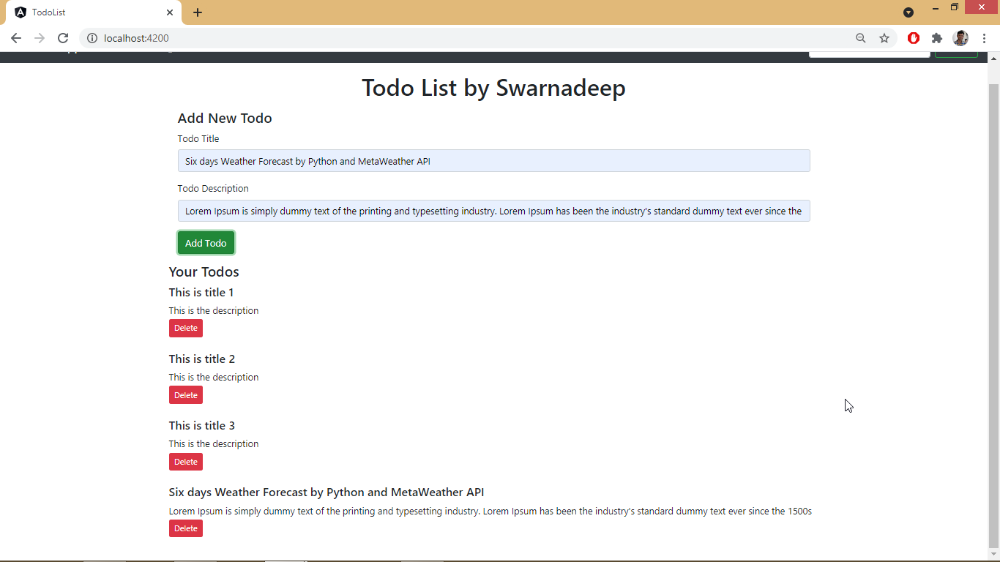
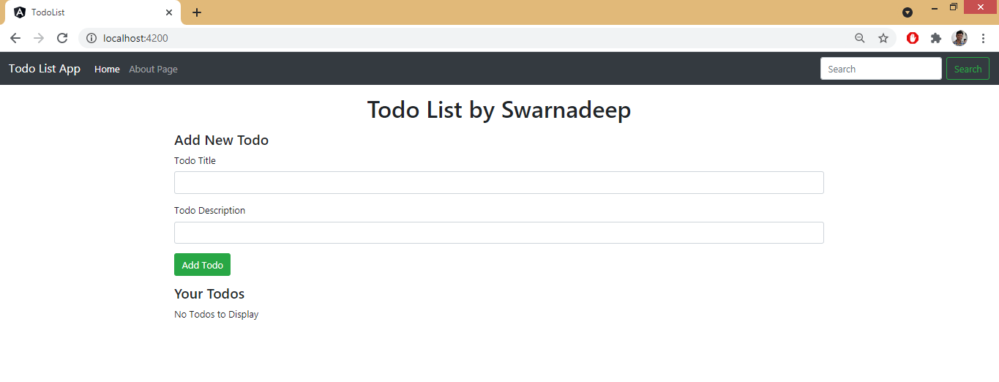
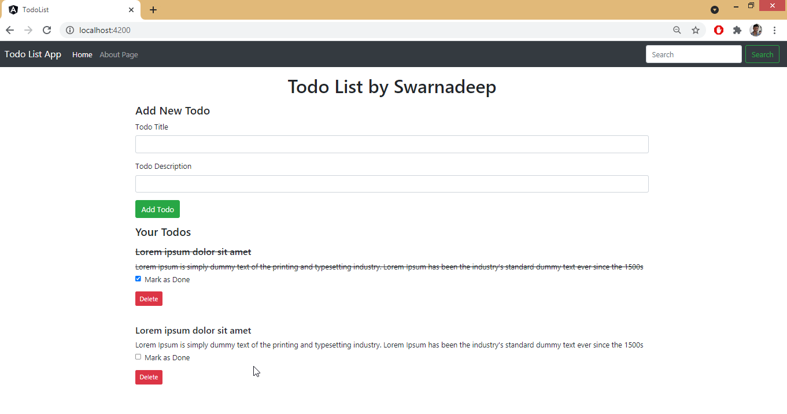

# Todo List Workflow Step by Step

### [Live Link](https://swarnadeepghosh.github.io/todo/)

### Table of Contents
- [Environment Setup](#environment-setup )

#### Prerequisite Installation

- Node
- Angular CLI
- VS Code

### Environment Setup 
```powershell
>ng new TodoList
>cd Todolist
>npm install bootstrap
>npm install jquery
```
Configure `angular.json`
```json
"architect": {
        "build": {
            "styles": [
              "src/styles.css",
              "./node_modules/bootstrap/dist/css/bootstrap.min.css"
            ],
            "scripts": [
              "./node_modulFes/jquery/dist/jquery.min.js",
              "./node_modules/bootstrap/dist/js/bootstrap.js"
            ]
          },
```


Welcome Page


### Components

Used 3 components :

- **app** component -- for the homepage header and footer

- **todos** component -- for the whole Todo List content 

- **todo-item** component -- for individual todo item which will be populated below the todo list

- **add-todo** Component -- to add new todo


#### app Component

***app.component.html***

Paste bootstrap navbar and generate a component **todos** .

Map todos component in app component by adding this : `<app-todos></app-todos>`


***app.component.ts***

```typescript
export class AppComponent {
  title = 'TodoList';
  constructor() {
    // Timeout function will change the title without PAGE RELOAD
    setTimeout(() => {
    this.title = "Changed Title";
    }, 2000);
  }
}
```


***Todo.ts - Created a Todo Model***

Todo.ts is a Angular Model Class
This is a model to generate lot of Todo in todo list.

```typescript
export class Todo{
    sno:number
    title:string
    desc:string
    active:boolean
}
```


#### todo Component

***todos.component.html***

```html
<ul *ngFor="let todo of todos">
    <!-- Creating a Custom Attribute [todo] and passing "todo" in app-todo-item -->
    <app-todo-item [todo]="todo"></app-todo-item>
</ul>
```


***todos.component.ts***

Created a todos Array which is of type **Todo Model Class** and put some values in it.

```typescript
export class TodosComponent implements OnInit {
  todos: Todo[];
  constructor() {
    this.todos = [
      {
        sno:1,
        title:"This is title 1",
        desc:"This is the description",
        active:true
      },
      {
        sno:2,
        title:"This is title 2",
        desc:"This is the description",
        active:true
      },
      {
        sno:3,
        title:"This is title 3",
        desc:"This is the description",
        active:true
      }
    ]
  }

  ngOnInit(): void { }
}
```


#### todo-item Component

***todo-item.component.html***

Control will come here when user trying to **add/ delete/ view todos**

To receive todo from todos.component, We have to add **Input Decorator** in todo-item.component.ts

Also created a **click** event, which will call **onClick()** method everytime it gets called. And passing the todo to display it in console and to delete it.

```html
<div>
    <h5>{{todo.title}}</h5>
    <p>{{todo.desc}}</p>
    <!-- Creating a (click) event with name onClick()-->
    <button class="btn btn-danger" (click)="onClick(todo)">Delete</button>
</div>
```


***todo-item.component.ts***

```typescript
export class TodoItemComponent implements OnInit {
  //Adding Input Decorator to receive todo from todos.component  
  @Input() todo: Todo;
  constructor() { }

  ngOnInit(): void { }

  // Handling (click) event by onClick() method
  onClick(todo: Todo){
    console.log("onClick triggered")
    console.log(todo);
  }
}
```


### Functionality

#### Delete a todo

If we click on delete on a particular todo, we have to emit a event from ***todo-item.component.ts*** and ***todos.component.ts*** will receive the event and delete the todo from the predefined **todos** Array.

Emmiting a Event from ***todo-item.component.ts***

```typescript
export class TodoItemComponent implements OnInit {
  @Input() todo: Todo;

  //Emitting a event todoDelete, which will received by todos.component.ts and delete the todo from todos Array
  @Output() todoDelete:EventEmitter<Todo> = new EventEmitter();
  
  constructor() { }
  ngOnInit(): void { }

  onClick(todo: Todo){
    //Emmitting the event
    this.todoDelete.emit(todo);
    console.log("onClick triggered")
  }
}
```


Listen **todoDelete** event from ***todos.component.html***

We have to Listen the event **todoDelete** and run **deleteTodo** function, passing the **event(todo)** within it.

```html
<app-todo-item [todo]="todo" (todoDelete)="deleteTodo($event)"></app-todo-item>
```


Write **deleteTodo** function in ***todos.component.ts***

```typescript
export class TodosComponent implements OnInit {
 ...
 ...
  deleteTodo(todo: Todo){
    console.log(todo);
    //This will take the index and delete it from array by splice method
    const index = this.todos.indexOf(todo);
    this.todos.splice(index,1);
  }
}
```


**Screenshots**

- Initial Stage before deletion


- After delete 2nd todo


#### Add a todo

##### add-todo Component

***add-todo.component.html***

Handling **ngSubmit** Event with **onSubmit()** method which will add a new **todo** to **todos** list.

Taking input title and Description and bind them in variable using **(ngModel)** directive.

```html
<div class="container my-3">
   <h4>Add New Todo</h4>
    <form (ngSubmit)="onSubmit()">
        <div class="form-group">
            <label for="title">Todo Title</label>
            <!-- Bind ngModel directive to store input title -->
      		<input type="text" [(ngModel)]="title" class="form-control" id="title">
        </div>
        <div class="form-group">
            <label for="desc">Todo Description</label>
            <!-- Bind ngModel directive to store input Description -->
            <input type="text" [(ngModel)]="desc" class="form-control" id="desc">
        </div>
        <button type="submit" class="btn btn-success">Add Todo</button>
    </form>
</div>
```


***app.module.ts*** 

Add **FormsModule** in **imports** to work with **(ngModel)** directive

```typescript
imports: [
    BrowserModule,
    AppRoutingModule,
    FormsModule
  ]
```


***add-todo.component.ts***

Created a method onSubmit() which will **create todo** with given inputs and **emitting event** to add it into todos array

Emitting a event **todoAdd**, which will received by **todos.component.ts** and added the **todo** into **todos** Array

```typescript
export class AddTodoComponent implements OnInit {
  title: string;
  desc: string;
  @Output() todoAdd:EventEmitter<Todo> = new EventEmitter();

  constructor() { }
  ngOnInit(): void {  }
  
  onSubmit() {
    const todo = {
      sno: 8,
      title: this.title,
      desc: this.desc,
      active: true
    }
    //Emmitting the event and passing todo
    this.todoAdd.emit(todo);
  }
}
```


Listen  **todoAdd** event from ***todos.component.html***

We have to Listen the event **todoAdd** and run **addTodo** function, passing the **event(todo)** within it.

```html
<app-add-todo (todoAdd)="addTodo($event)"></app-add-todo>
```


Write **addTodo** function in ***todos.component.ts***

This will push the todo into the todo array.

```typescript
addTodo(todo: Todo){
    console.log(todo);
    this.todos.push(todo);
  }
```


Before Add




After Add




#### Empty todo text

If there is **no todo present** in the array, we can display **No Todos to Display** by **ngIf** block.

***todos.component.html***

```html
<app-add-todo (todoAdd)="addTodo($event)"></app-add-todo>
<h4>Your Todos</h4>
<div *ngIf="this.todos.length===0; else elseBlock">No Todos to Display</div>
<ng-template #elseBlock>
    <div *ngFor="let todo of todos">
        <app-todo-item [todo]="todo" (todoDelete)="deleteTodo($event)"></app-todo-item>
    </div>
</ng-template>
```




#### Saving in Localstorage

First empty the hardcoded todos array in ***todos.component.html***

```typescript
export class TodosComponent implements OnInit {
...
  constructor() {
    //todos Array where todo will store and display
    this.todos = [  ]
  }
...
```


***todos.component.ts***

Fetching **todos array** from **localStorage**. 

If localstorage is empty, empty todos array will initialise. 

If localstorage have existing todos array, then we will parse that, save that in todos array and display.

Also we are **saving the updated todos** array in localStorage after any **Add** or **Delete** operation.

```typescript
export class TodosComponent implements OnInit {
  todos: Todo[];
  localItem:string;
  constructor() {
    // 
    this.localItem = localStorage.getItem("todos");
    if(this.localItem==null){
      this.todos = [  ]
    }
    else{
      this.todos=JSON.parse(this.localItem);
    }
  }
  ngOnInit(): void { }

  deleteTodo(todo: Todo){
    console.log(todo);
    const index = this.todos.indexOf(todo);
    this.todos.splice(index,1);
    // Saving the updated todos array in localStorage
    localStorage.setItem("todos",JSON.stringify(this.todos));
  }

  addTodo(todo: Todo){
    console.log(todo);
    this.todos.push(todo);
    // Saving the updated todos array in localStorage
    localStorage.setItem("todos",JSON.stringify(this.todos));
  }
}
```

*Thus even after reloading the page, our todo list is still saved at its last state..* 


#### Mark as Done

Add a **checkbox** in ***todo-item.component.html***

Creating a ngClass custom attribute, which will set the element class to strike it it not active.

Also invoking method **onCheckboxClick** on checkbox click. Also taking index of for loop and making unique id for each checkbox.

```html
<!--To receive todo from todos.component, We have to add Input Decorator in todo-item.component.ts-->
<div class="my-3">
    <h5 [ngClass]="{'strike': !todo.active}">{{todo.title}}</h5>
    <p class="mb-1" [ngClass]="{'strike': !todo.active}">{{todo.desc}}</p>
    <div class="form-group form-check">
         <input type="checkbox" class="form-check-input" (click)="onCheckboxClick(todo)" [checked]="!todo.active" id="done{{i}}">
        <label class="form-check-label" for="done{{i}}">Mark as Done</label>
      </div>
    <!-- Creating a (click) event with name onClick()-->
    <button class="btn btn-sm btn-danger mb-4" (click)="onClick(todo)">Delete</button>
</div>
```

***todo-item.component.css***

```css
.strike{
    text-decoration: line-through;
}
```


***todo-item.component.ts***

Creating a new Event Emitter and emit **todoCheckbox** to change active status in ***todos.component.ts***. Also taking index of the for loop  (which was iterating from ***todos.component.html*** )

```typescript
export class TodoItemComponent implements OnInit {
  ...
  @Input() i:number;
  @Output() todoCheckbox:EventEmitter<Todo> = new EventEmitter();
  onCheckboxClick(todo: Todo){
    this.todoCheckbox.emit(todo);
  }
}
```


Listening **todoCheckbox** in ***todos.component.html*** and invoke function **toggleTodo()**

```html
<app-add-todo (todoAdd)="addTodo($event)"></app-add-todo>
<h4>Your Todos</h4>
<div *ngIf="this.todos.length===0; else elseBlock">No Todos to Display</div>
<ng-template #elseBlock>
    <!-- Looping over list of todos by ngFor directive -->
    <div *ngFor="let todo of todos; index as i">
        <!-- Creating a Custom Attribute [todo] and passing "todo" in app-todo-item -->
        <!-- Listen the event todoDelete and run deleteTodo function ,passing the event(todo) within it -->
        <app-todo-item [todo]="todo" [i]="i" (todoDelete)="deleteTodo($event)" (todoCheckbox)="toggleTodo($event)"></app-todo-item>
    </div>
</ng-template>
```


Write **toggleTodo()** method to change the active status in ***todos.component.ts***

```typescript
export class TodosComponent implements OnInit {
  ...
  toggleTodo(todo: Todo){
    const index = this.todos.indexOf(todo);
    this.todos[index].active = !this.todos[index].active;
    localStorage.setItem("todos",JSON.stringify(this.todos));
  }
}
```

After toggle checkbox completed :




### Routing Module

The main cool feature of Angular is to navigate through pages without refresh the page.

Creating a new **'About' Component** for navigation. And putting a simple jumbrotron in ***about.component.html*** file.

 

***app-routing.module.ts***

Setting the path for the two components which will be navigated in the navbar

```typescript
const routes: Routes = [
  { path: '', component: TodosComponent },
  { path: 'about', component: AboutComponent },
];
```


***app-routing.module.html***

just keep **router-outlet** and **nav** tags in html . Dont need any `<app-todos>` tag.

We have to use **routerLink** in place of **href**.

```html
<a class="nav-link" routerLink="/">Home <span class="sr-only">(current)</span></a>
...
<a class="nav-link" routerLink="/about">About Page</a>
...
<router-outlet></router-outlet>
```


### Build for PROD

```powershell
>ng build --prod 
# To host it on github, we have to change base-href in index.html afterwards.
# Or we can use below command
>ng build --prod --base-href /todo/
```


***index.html***

```html
<base href="/todo/">
(to host in github)
```

